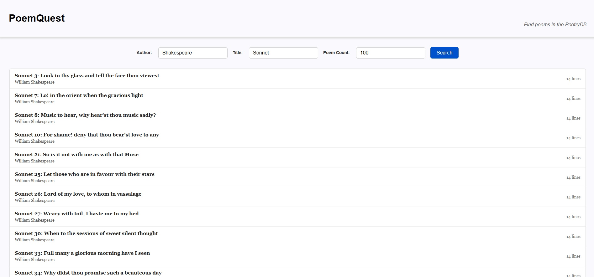

PoemQuest
=========
A website to query the [PoetryDB](https://poetrydb.org), adapted from the Angular [first-app](https://angular.dev/tutorials/first-app) and [signals](https://angular.dev/tutorials/signals) tutorials.

Requirements
------------
- [NodeJS](https://nodejs.org) v20+

Development
-----------
1. Navigate to the app root: `cd gui`
2. Install the dependencies: `npm install`
3. Compile and host locally: `npm run start`
4. Navigate to the website at: [http://localhost:4200](http://localhost:4200)

Deploy
------

This repository includes a Dockerfile to build and run this website in a Docker container.
After installing [Docker](https://www.docker.com/), run the following commands...

**To build the Docker image:**
```bash
docker build --tag poem-quest:v0.2.0 .
```

**To host the website at [http://localhost:4200](http://localhost:4200)**
```bash
docker run --publish 4200:80 --tty poem-quest:v0.2.0
```

Notes
-----
- AngularJS is the chosen framework.
- The `@angular/material` library is added for the autocomplete module.
- Search functionality to find poems implemented in [home.ts](gui/src/app/home/home.ts)
- Search result display implemented in [poem-entry.ts](gui/src/app/poem-entry/poem-entry.ts)
- Poem detail view implemented in [poem-details.ts](gui/src/app/poem-details/poem-details.ts)
- As an additional feature, the complete list of author names are queried on page load and used to autocomplete the author search field.
- Angular Signals used to support reactivity.
- Loading text is displayed when fetching search results and poem text.
- This site uses the PoetryDB REST API in three different ways, all of which can be found in the [poem.service.ts](gui/src/app/poem.service.ts)
- State is managed local to each route and in a top-down manner.
- Known issue: because there is no global state management, the search arguments and results do not persist after navigating to a poem display.
- The number of poem search results may be limited by the Poem Count Field, but performance is acceptable even up to hundreds of results since the poem text is not requested in the search request.
- Even for a single large poem, performance on the poem details route is acceptable since the metadata is redundantly requested, and the text is loaded asynchronously.

Example
-------


License
-------
MIT
